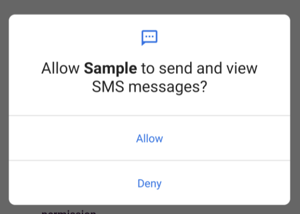
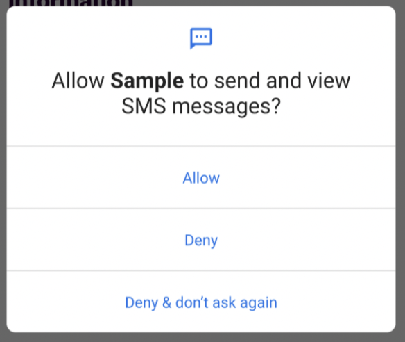

# Android Permissions - SMS Basics
## Introduction

The SMS Permission is consider a Runtime Permission. 
This means that if the user’s device runs Android 6 (api 23) or higher, 
the permissions needs te be requested in runtime. 
In older version the system will granted automatically at install time.

Source: [https://developer.android.com/training/permissions/declaring](https://developer.android.com/training/permissions/declaring)

## Never Ask Again

For runtime permissions, the user will be asked to accept or deny the permission, 
and after the first attempt the option `Never Ask Again` will be shown. 
If the use selects this option, the app will not be permitted to invoke the popup again.

## Android 11 (API level 30)
From Android 11 (API 30), if a runtinme permission is denied more than once, 
the system won’t see the popup again.
In advance, Android 11 also have auto-reset permission for unused apps.

Source: [https://developer.android.com/about/versions/11/privacy/permissions#dialog-visibility](https://developer.android.com/about/versions/11/privacy/permissions#dialog-visibility)