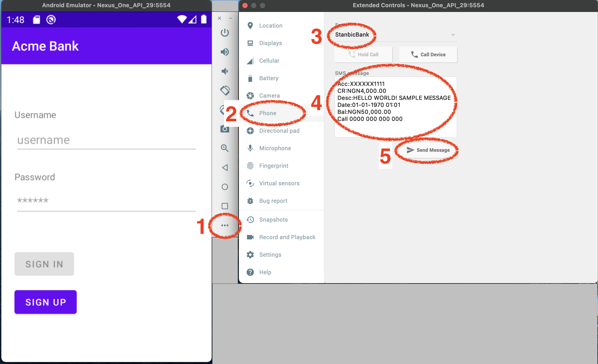

<p align="center">
  
  <h3 align="center">Pngme Android (Kotlin) SDK & Sample App</h3>
</p>

This documentation covers how to use the Pngme SDK with Kotlin.

You can find similar documentation for [Expo](https://github.com/pngme/sample-android-app-react-native-expo), [Flutter-Kotlin](https://github.com/pngme/sample-android-app-flutter), [Flutter-Java](https://github.com/pngme/sample-android-app-flutter_java) and [React Native](https://github.com/pngme/sample-android-app-react-native).

## Setup

1. The SDK supports Android API version 16+
1. The SDK enables your app to:
   1. Register a mobile phone user with Pngme
   1. Request SMS permissions from the user using a [Permission Dialog Flow](.docs/permission_flow.gif)
   1. Periodically send data to Pngme to analyze financial events
1. Using the SDK requires an **SDK Token**
   - [**Sign up for a free Pngme Dashboard account**](https://admin.pngme.com) then access your SDK token from the [Keys page](https://admin.pngme.com/keys)
   - Use the `test` SDK token during development but replace with the `production` SDK token before deploying your app to the Google Play store

<p align="center">
  
</p>

After integrating the SDK, financial data will be accessible in the [Pngme Dashboard](https://admin.pngme.com/users) and via the [Pngme REST APIs](https://developers.api.pngme.com/reference/).

## Integrating the SDK

### Step 1

Add the JitPack package manager to `/app/build.gradle`.

```groovy
    allprojects {
        repositories {
            maven { url 'https://jitpack.io' }
        }
    }
```

### Step 2

Add the following dependencies to `/app/build.gradle`.

```groovy
    dependencies {
        implementation 'com.github.pngme:android-sdk:4.0.2'
    }
```

### Step 3

Add your **SDK Token** to `local.properties`.

```text
PNGME_SDK_TOKEN=XXXXXXXXXX
```

> ⚠️ We recommend that additional measures be taken to protect the **SDK Token** when implementing in a production app. See here for some recommended methods: [How to secure secrets in Android](https://blog.kotlin-academy.com/how-to-secure-secrets-in-android-android-security-01-a345e97c82be).

### Step 4

Call the `PngmeSdk.go()` method in your app where you would like to trigger the [Permission Dialog Flow](.docs/permission_flow.gif).

## PngmeSDK API

### `go()`

```kotlin
 fun go(
     activity: AppCompatActivity,
     clientKey: String, // pass the SDK token here
     firstName: String,
     lastName: String,
     email: String,
     phoneNumber: String,
     externalId: String,
     companyName: String,
     onComplete: Callback? = null
 )
```

> The `go()` method can be safely invoked multiple times. The user will only be prompted for permissions when `go()` is called (1) the first time or (2) after `resetPermissionFlow()`.

The `go` method performs three tasks.

1. register a `user` in Pngme's system using an Android Onetime Worker
2. show a [Permission Dialog Flow](.docs/permission_flow.gif) in the current Activity to request SMS permissions from the user --
   by default, this _runs the first time, and only the first time_, that `go` is invoked
3. check for new SMS messages and send them to Pngme's system every 30 minutes using an Android Background Worker

| Field       | Description                                                                                                        |
| ----------- | ------------------------------------------------------------------------------------------------------------------ |
| activity    | a reference to the current Activity                                                                                |
| clientKey   | the SDK Token from the [Pngme Dashboard Keys page](https://admin.pngme.com/keys)                                   |
| firstName   | the mobile phone user's first name                                                                                 |
| lastName    | the mobile phone user's last name                                                                                  |
| email       | the mobile phone user's email address                                                                              |
| phoneNumber | the mobile phone user's phone number, example `"23411234567"`                                                      |
| externalId  | a unique identifier provided by your app (if none available, pass an empty string `""`)                            |
| companyName | your company's name; this is used in the display header of the [Permission Dialog Flow](.docs/permission_flow.gif) |
| onComplete  | a callback function that is called when the `go` method has completed                                              |

#### The onComplete callback

The `go` method should be invoked and left to complete while the `activity` is in a [running state](https://developer.android.com/guide/components/activities/activity-lifecycle).
The `onComplete` callback is a useful callback, for example,
in determining when it is safe to change the Activity state.
Additionally, the `onComplete` callback is a useful callback in determining
when the `activity` is no longer in use by the Permission Dialog Flow.

The `onComplete` callback will be invoked when three conditions are satisfied:

1. the Onetime Worker for registering a user with Pngme's system has been instantiated
2. the Period Worker for periodically sending SMS data to Pngme's system has been instantiated
3. the Permission Dialog Flow has exited

### `resetPermissionFlow()`

```kotlin
fun resetPermissionFlow(context: Context)
```

| Field   | Description             |
| ------- | ----------------------- |
| context | the current app Context |

The [Permission Dialog Flow](.docs/permission_flow.gif) will only run the first time that the `go` method is invoked.
If your app needs to implement logic to show the Dialog Flow again,
then you can reset the permission flow by calling `resetPermissionFlow`.

### `isPermissionGranted()`

```kotlin
fun isPermissionGranted(context: Context): Boolean
```

| Field   | Description             |
| ------- | ----------------------- |
| context | the current app Context |

This indicates if the user has accepted the SMS permissions request:

- Returns `true` if the user has accepted the SMS permission request.
- Returns `false` if the user has denied the SMS permission request.

## Sample Android App

This repository is a sample Android app, which uses the Pngme SDK.
This app uses the `local.properties` file to inject the SDK Token.
As noted above, it is highly recommended that a production application use a more secure method of injecting the SDK Token secret.

This app can be compiled and emulated locally, with or without a valid SDK Token.
If a valid SDK Token is used, then data can be sent thru to the Pngme system.

> Before launching the app, you might want to have some SMS ready in the phone's inbox for faster testing. Refer to the section [Send SMS data locally](#Send-SMS-data-locally) down below

### Running the app

Debug version:

```bash
./gradlew app:installDebug
```

Building the app:

```bash
./gradlew
```

### Setup

Add the following to your `local.properties` file:

```text
SHARED_PREF_NAME=my_app_shared_pref
PNGME_SDK_TOKEN=XXXXXXXX
```

### Behavior

The sample app demonstrates a simple flow:

1. user creates an account with the app
2. the user goes to apply for a loan, and has the option of selecting to use the Pngme service
3. if the Pngme service is selected, the SDK is invoked, and the [Permission Flow](.docs/permission_flow.gif) is presented

<sub>- :warning: _Note that if a user chooses to hide the permissions flow, they will need to design their own information and consent screen compliant with Google Whitelisting requirements. Consult with <support@pngme.com> if you would like assistance with this process._</sub> 4. when the permission flow exits, the user is presented with the loan application page

The SDK is implemented in the `PermissionFragment`, when the user clicks on the _Continue_ button:

```kotlin
continueButton.setOnClickListener {
    // save state of checkBox
    if (usePngmeCheckBox.isChecked) {
        setPngmeAsChecked()
        val mainActivity = (activity as MainActivity)
        getUser()?.let { user ->
            PngmeSdk.go(
                mainActivity,
                BuildConfig.PNGME_SDK_TOKEN,
                user.firstName,
                user.lastName,
                user.email,
                user.phoneNumber,
                "",
                MainActivity.COMPANY_NAME
            ) {
                navigateToLoadApplication()
            }
        }
    } else {
        navigateToLoadApplication()
    }
}
```

The app remembers the selection in step 2.
If the user chooses to enable the Pngme service,
then the checkbox stays selected for all future loan applications.
The [Permission Flow](.docs/permission_flow.gif) is only showed the very first time,
_regardless of if the user accepts or denies the permissions_.

#### Show Permissions Flow Multiple Times

Alternative behavior is to continue requesting SMS permissions if they were previously denied.
Adding the following snippet will reset the Permission Flow
if SMS permissions had been previously denied but not [permanently ignored](.docs/permissions.md).

```kotlin
continueButton.setOnClickListener {
    // save state of checkBox
    if (usePngmeCheckBox.isChecked) {
        setPngmeAsChecked()
        if (!smsPermissionGranted() && smsNeverPermanentlyIgnored()) {
            context?.let {
                PngmeSdk.resetPermissionFlow(it)
            }
        }
        val mainActivity = (activity as MainActivity)
        getUser()?.let { user ->
            PngmeSdk.go(
                mainActivity,
                BuildConfig.PNGME_SDK_TOKEN,
                user.firstName,
                user.lastName,
                user.email,
                user.phoneNumber,
                "",
                false,
                MainActivity.COMPANY_NAME
            ) {
                navigateToLoadApplication()
            }
        }
    } else {
        navigateToLoadApplication()
    }
}
```

### Sending test data

This can be tested in a sample app running in the local emulator,
assuming the emulated app is running with a valid SDK token.

Android Emulator can simulate incoming SMS messages, and we can use this to test the Pngme SDK locally.

The following text message is of a recognized format for the Stanbic bank sender: `Stanbic`.

```text
Acc:XXXXXX1111
CR:NGN4,000.00
Desc:HELLO WORLD! SAMPLE MESSAGE
Bal:NGN50,000.00
```

You can inject this fake SMS into the emulated phone by following these steps.

> Once the app gets the permissions form the user it will instantly start sending existing SMS messages to the Pngme system. This results in messages being seen much sooner than SMS received after the app was installed.
>
> The background worker processes new messages every 30 minutes, so new messages will take at least 30 minutes to appear in the webconsole.



1. Open the `more` window in the emulator settings
2. Navigate to the `phone` section
3. Set the sender to the string `Stanbic` or one of the senders from our [supported institutions](https://developers.api.pngme.com/reference/supported-institutions)
4. Copy/Paste the above same message into the message box
5. Hit `Send Message`

After following the above steps to send a fake SMS, run the sample app.
The fake SMS will be sent to the Pngme system using the SDK token from your Pngme account.
If the sample app runs successfully, the financial data in the text message will be accessible
via the [Pngme REST APIs](https://developers.api.pngme.com/reference/getting-started-with-your-api) or in the [Pngme webconsole](https://admin.pngme.com).

## Next steps

See [Going Live with the SDK](https://developers.api.pngme.com/docs/going-live-with-the-sdk) to learn more about the whitelisting process with the Google Play store.
